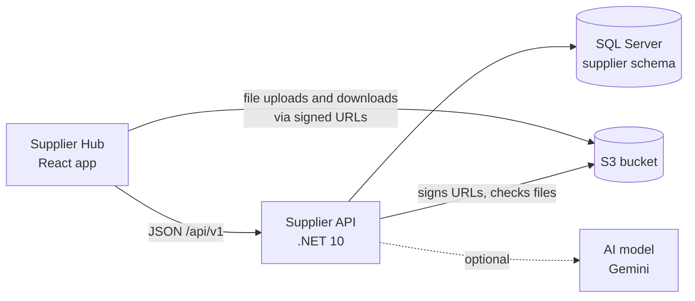

# Travelogic Services: Supplier Hub

A back-office system for a tour operator to manage **suppliers** (lodges, hotels, activity operators, transfer companies, restaurants), the **services** they sell with their prices, and **photos and videos** of each supplier. An optional **AI import** reads a pasted rate sheet or email and pre-fills the supplier form for a person to review.

| Folder | What it is |
| --- | --- |
| [`backend/`](backend/) | Supplier API: ASP.NET Core (.NET 10), SQL Server, S3 for media, optional AI (Gemini or any OpenAI-compatible model). See [backend/README.md](backend/README.md). |
| [`frontend/`](frontend/) | Supplier Hub web app: React (TanStack Start, Router and Query), Tailwind and shadcn/ui. |
| [`docs/`](docs/) | [Architecture and technical decisions](docs/architecture.md). |



## Run it locally

You need [Docker](https://www.docker.com/products/docker-desktop/) and [Node.js](https://nodejs.org/) 20+ (or [Bun](https://bun.sh/)).

**1. Start the API, database and S3 store**

```bash
cd backend
docker compose up --build
```

The API runs on http://localhost:5000 (interactive docs at http://localhost:5000/scalar/v1) and is seeded with six South African suppliers. To switch on the AI import, copy `backend/.env.example` to `backend/.env`, add your model and key, and run `docker compose up -d` again.

**2. Start the web app** (in a second terminal)

```bash
cd frontend
cp .env.example .env.local   # use the real API instead of mock data
npm install                  # or: bun install
npm run dev                  # or: bun run dev
```

Open the address it prints (usually http://localhost:8080).

## Tests

- Backend: `cd backend && dotnet test` (needs Docker; the integration tests start their own SQL Server and S3 containers).
- Frontend: `cd frontend && npx tsc --noEmit && npm run lint`.

GitHub Actions runs both on every push (`.github/workflows/ci.yml`).

## Repository history

Both projects were developed in separate repositories and merged here with their full commit history (`git subtree`). The frontend was started in Lovable; its original repository (`safari-hub-front`) is still the one connected to the Lovable editor.
