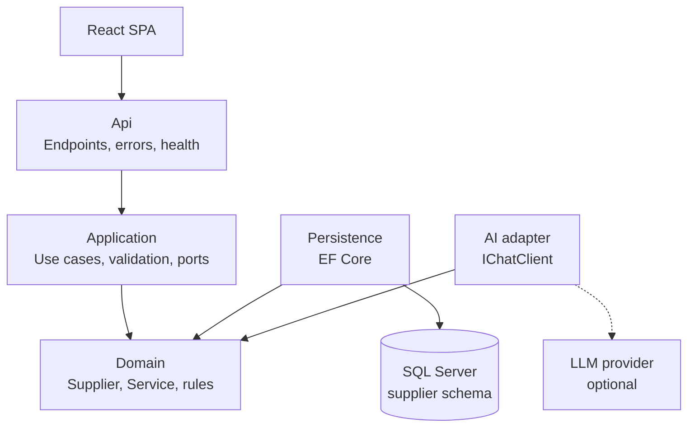

# Supplier Management API

A standalone ASP.NET Core (.NET 10) service that owns all supplier and service data for a tour operator's platform: lodges, hotels, activity operators, transfer companies and restaurants, and the bookable services each one offers. It has its own SQL Server database, publishes an OpenAPI contract, and can optionally use an AI model to turn a pasted rate sheet into a draft supplier.

## The problem

Tour operators keep supplier details in spreadsheets, emails and PDF contracts. Every itinerary depends on that data, so it needs one reliable home that enforces the business rules (valid prices and currencies, no duplicate suppliers) and serves it to the rest of the platform through a clear API. Entering a supplier from a long rate sheet is slow, so the optional AI feature pre-fills the form for a person to review.

## Architecture

Clean Architecture with ports and adapters: dependencies point inward, and the Domain has no framework dependencies at all.



| Project | Responsibility |
| --- | --- |
| `Suppliers.Domain` | `Supplier` aggregate and `Service` entity, enums, business rules. No NuGet packages. |
| `Suppliers.Application` | Use cases (create, get, list, extract), FluentValidation, DTOs, and the ports `ISupplierRepository`, `ISupplierQueries`, `ISupplierExtractionService`. |
| `Suppliers.Infrastructure` | EF Core persistence in the `supplier` schema, migrations, seed data, and the AI adapter. Implements the Application ports. |
| `Suppliers.Api` | Minimal-API endpoints, ProblemDetails error handling, OpenAPI and Scalar, health checks, CORS, rate limiting, logging. |

## Tech stack

.NET 10 and ASP.NET Core minimal APIs · EF Core 10 on SQL Server 2022 · FluentValidation · Asp.Versioning · Scalar (API docs) · Serilog · Microsoft.Extensions.AI · xUnit, NSubstitute, Shouldly, Testcontainers · Docker Compose · GitHub Actions.

## Quick start

You need [Docker](https://www.docker.com/products/docker-desktop/) running.

```bash
git clone git@github.com:BelchiorAI/Travelogic_Services.git
cd Travelogic_Services/backend
docker compose up --build
```

On Windows, if `git clone` reports "Filename too long", clone into a shorter folder or run `git config --global core.longpaths true` first.

When `suppliers-api` has started:

- API: http://localhost:5000
- API docs (Scalar): http://localhost:5000/scalar/v1
- OpenAPI document: http://localhost:5000/openapi/v1.json
- Health: http://localhost:5000/health/ready

The database is created, migrated and seeded with six South African suppliers on first start. Stop the stack with `docker compose down`, and add `-v` to delete the database too.

## Running the API without Docker for the API

You need the [.NET 10 SDK](https://dotnet.microsoft.com/download) and Docker for SQL Server.

```bash
docker compose up -d sqlserver
dotnet run --project src/api/Suppliers.Api
```

The API listens on http://localhost:5000 and, in the Development environment, applies migrations and seeds on startup. The development connection string in `appsettings.Development.json` matches the local SQL Server container's throwaway password. Override any setting with environment variables, for example `ConnectionStrings__SuppliersDb`, or with `dotnet user-secrets` for local secrets.

The frontend runs separately: in `../frontend`, copy `.env.example` to `.env.local` (it sets `VITE_API_BASE_URL=http://localhost:5000` and `VITE_USE_MOCKS=false`) and run `npm run dev`. In Development and in the compose stack, CORS allows any `http://localhost` port, because dev servers move to the next free port. Other environments allow only the origins listed in `Cors:AllowedOrigins`.

## API

All routes are versioned under `/api/v1`. JSON properties are camelCase, and enums travel as strings.

| Method | Route | Returns |
| --- | --- | --- |
| GET | `/api/v1/suppliers?page&pageSize&search&type` | 200 `PagedResult<SupplierSummaryDto>`; `search` matches name, city or email; page size capped at 50 |
| GET | `/api/v1/suppliers/{id}` | 200 `SupplierDto` / 404 |
| POST | `/api/v1/suppliers` | 201 + `Location` / 400 / 409 |
| POST | `/api/v1/suppliers/extract` | 200 `{ draft, warnings }` / 400 / 429 / 502 / 503 |
| POST | `/api/v1/suppliers/{id}/media/uploads` | 200 upload ticket (signed S3 URL) / 400 / 404 |
| POST | `/api/v1/suppliers/{id}/media` | 201 `MediaDto` / 400 / 404 (confirms an uploaded file) |
| DELETE | `/api/v1/suppliers/{id}/media/{mediaId}` | 204 / 404 |
| GET | `/api/v1/media/{mediaId}` | 302 to a short-lived signed S3 URL / 404 |
| GET | `/api/v1/features` | 200 `{ aiExtraction: bool }` |
| GET | `/health/live`, `/health/ready` | 200 when the process is up / when SQL Server is also reachable |

- `SupplierType`: Accommodation, Activity, Transport, Restaurant, Other
- `ServiceType`: Accommodation, Activity, Tour, Transfer, Meal, Other
- `PricingUnit`: PerPerson, PerPersonPerNight, PerRoomPerNight, PerVehicle, PerGroup

Errors are RFC 7807 ProblemDetails. Validation errors use keys that match the form fields, such as `Services[0].Price`:

```json
{
  "title": "One or more validation errors occurred.",
  "status": 400,
  "errors": {
    "Name": ["'Name' must not be empty."],
    "Services[0].Price": ["'Price' must be greater than or equal to '0'."]
  }
}
```

**Business rules:** names are required and at most 200 characters; prices are 0 or more; currency is a 3-letter uppercase ISO code (e.g. `ZAR`); duration and capacity must be positive when given; a supplier has at most 50 services; the same supplier name cannot be used twice in one city (409).

**Photos and videos:** JPEG, PNG or WebP images up to 10 MB and MP4 or WebM videos up to 100 MB, at most 20 per supplier. Files live in **S3** (AWS S3 in production; locally the compose stack runs [Versity S3 Gateway](https://github.com/versity/versitygw), an S3-compatible server). The database stores only each file's **key** (e.g. `suppliers/{supplierId}/{mediaId}.mp4`) with its type, size and name, never the bytes.

Uploads go straight from the browser to S3, so large videos never pass through the API:

1. `POST /suppliers/{id}/media/uploads` with `{ fileName, contentType, sizeBytes }`. The API checks the type, size and per-supplier limit and returns `{ mediaId, uploadUrl, method, headers, expiresAt }` (valid 15 minutes).
2. The browser sends the file to `uploadUrl` with that method and headers.
3. `POST /suppliers/{id}/media` with `{ mediaId, fileName, contentType }`. The API checks the object exists, identifies its real type from its first bytes (a renamed file is rejected and deleted), records its real size, and saves the reference.

`GET /media/{id}` is a stable URL that redirects to a signed S3 URL (valid one hour), which supports range requests for video. `SupplierDto.media` lists the files, and list items carry a `coverImageUrl` (the oldest photo).

**Using AWS S3:** set `Media:S3:BucketName` and `Media:S3:Region`, leave `ServiceUrl` empty, and either set `AccessKey`/`SecretKey` or leave them empty to use the default AWS credential chain (e.g. an IAM role). The bucket needs a CORS rule allowing `PUT` and `GET` from the frontend's origin.

## AI extraction (optional)

`POST /api/v1/suppliers/extract` with `{ "text": "..." }` sends pasted text (a rate sheet, contract or email) to an AI model and returns a **draft** to pre-fill the create form. It never saves anything: a person reviews the draft and submits it through the normal create endpoint. The draft goes through the same validation as a real request, and any problems come back as `warnings` with the same field keys, so the form can highlight them. Fields the text doesn't state are left empty instead of guessed.

It works with any OpenAI-compatible provider. Without a key the app runs normally, `/features` reports `aiExtraction: false`, and the endpoint returns 503.

**With Docker Compose:** copy `.env.example` to `.env` (git-ignored), fill in the values and restart:

```bash
AI_ENABLED=true
AI_MODEL=<model name from your provider>
AI_API_KEY=<your API key>
AI_ENDPOINT=            # empty for OpenAI
```

**With `dotnet run`:** keep the key out of source control with user-secrets:

```bash
dotnet user-secrets --project src/api/Suppliers.Api set "Ai:Enabled" "true"
dotnet user-secrets --project src/api/Suppliers.Api set "Ai:Model" "<model name>"
dotnet user-secrets --project src/api/Suppliers.Api set "Ai:ApiKey" "<your API key>"
```

For Gemini, also set `Ai:Endpoint` (or `AI_ENDPOINT`) to its OpenAI-compatible URL, `https://generativelanguage.googleapis.com/v1beta/openai/`. So far the provider connection and error handling have been checked against OpenAI's API; a full extraction with a real key, and Gemini, are not yet tested.

Limits: 20,000 characters of input, a 30-second model timeout (`Ai:TimeoutSeconds`), and 10 requests per minute per client IP (429 with `Retry-After`).

## Running the tests

Docker must be running: the integration tests start their own SQL Server container with Testcontainers.

```bash
dotnet test
```

- **Unit tests** (`tests/Suppliers.UnitTests`): domain rules, validators and handlers, with NSubstitute fakes.
- **Integration tests** (`tests/Suppliers.IntegrationTests`): the real API against a real SQL Server, covering creation and retrieval, the `Services[0].Price` error format, 404 and 409, search, filtering and paging, health, OpenAPI, and AI extraction with a fake `IChatClient`, so tests never call a real model.

CI (`.github/workflows/ci.yml` at the repository root) runs the build and all tests, and builds the Docker image, on every push.

## Design decisions and trade-offs

- **Rules live in the Domain, and are checked again at the edge.** `Supplier.Create` and `AddService` guard every invariant, so no invalid aggregate can exist. FluentValidation repeats the rules up front to return all field errors at once with form-friendly keys; the domain guards are the backstop.
- **Validation runs inside the create use case**, not in an HTTP filter, so the use case is safe whatever calls it; AI extraction reuses the same validator to produce its warnings.
- **Separate read and write ports.** Writes load the aggregate through `ISupplierRepository`; reads project straight to DTOs with `AsNoTracking` through `ISupplierQueries`.
- **No MediatR or AutoMapper.** Both became commercial in 2025, and plain handler classes and hand-written mappings are easy to follow and debug.
- **Enums are stored as strings**, so the data is readable and adding a value can never shift existing rows. **Money is `decimal(18,2)`**, never a float.
- **Duplicates are blocked twice:** a friendly check before insert, and a unique index on (Name, City) that turns a race between two requests into a 409 instead of a duplicate.
- **Optimistic concurrency** with a `rowversion` column, ready for updates.
- **Missing values fail validation instead of defaulting.** Supplier type, service price and pricing unit are nullable in the request, so omitting them returns 400 rather than silently creating an Accommodation supplier priced at 0.
- **Independent service:** own schema and database, config from the environment, live/ready health checks (restart vs. stop sending traffic, as orchestrators like Kubernetes do), runs as a non-root user in its container.
- **Media in object storage, references in the database.** `IMediaStorage` is a port with an S3 adapter. Browsers upload and download directly with signed URLs, so the API and database never carry file bytes; the API only signs, verifies and records.
- **AI is an adapter behind a port.** The model plugs in through `IChatClient`, is switched off without a key, is rate-limited because calls cost money, treats the pasted text strictly as data, and never writes to the database.
- **Development convenience vs. secrets:** the local connection string uses the same throwaway password as `docker-compose.yml`, so a fresh clone runs in one command. Real deployments set `ConnectionStrings__SuppliersDb` and `MSSQL_SA_PASSWORD` from a secret store.

## Future work

- Rates and seasons (date-ranged prices, high and low season).
- Availability and allocations.
- Update and delete endpoints (the aggregate and `rowversion` are ready for them).
- Publish a `SupplierCreated` event through a transactional outbox, so other services can react.
- Authentication and authorisation (uploads and deletes are currently open, like the rest of the API).
- A CDN in front of the media bucket, thumbnails for large photos, virus scanning of uploads, and an S3 lifecycle rule to clean up uploads that were never confirmed.
- A `web` service in Docker Compose serving the built frontend through nginx.
- Generate the frontend's TypeScript types from the OpenAPI document.
