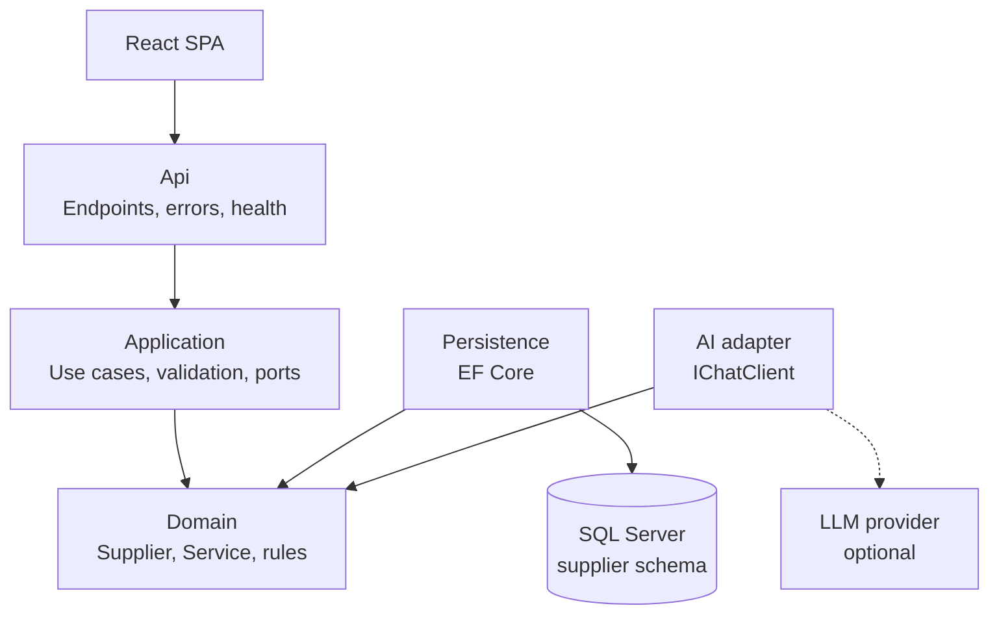

# Supplier Hub — Backend Implementation Plan

Sep 23, 2026 · @Someone

## Overview

The Supplier API is a standalone ASP.NET Core (.NET 10) service that owns all supplier and service data for a tour operator's platform, backed by its own SQL Server database. It is built in nine phases; the core brief is complete and submittable after Phase 6, and AI extraction (Phase 7) is a bonus layered on top.

**Guiding principles**

- Clean Architecture: dependencies point inward to the Domain, which has no framework dependencies.
- Ports and adapters: the database and the AI model plug in at the edge behind interfaces.
- Independent service: own schema, own database, OpenAPI contract, config from environment, health checks, containerised.
- Runnable in one command: `docker compose up` from a fresh clone.
- Commit in small, meaningful steps (e.g. `feat(domain): add Supplier aggregate with AddService rule`).

**Architecture**



Persistence and the AI adapter live in the Infrastructure project and implement interfaces defined in Application.

**API contract (must match the frontend)**

| Method | Route | Returns |
| --- | --- | --- |
| GET | `/api/v1/suppliers?page&pageSize&search&type` | 200 `PagedResult<SupplierSummaryDto>` |
| GET | `/api/v1/suppliers/{id}` | 200 `SupplierDto` / 404 |
| POST | `/api/v1/suppliers` | 201 + `Location` / 400 / 409 |
| GET | `/api/v1/features` | 200 `{ aiExtraction: bool }` |
| POST | `/api/v1/suppliers/extract` | 200 `{ draft, warnings }` (Phase 7) |

Enums travel as strings: `SupplierType` (Accommodation, Activity, Transport, Restaurant, Other), `ServiceType` (Accommodation, Activity, Tour, Transfer, Meal, Other), `PricingUnit` (PerPerson, PerPersonPerNight, PerRoomPerNight, PerVehicle, PerGroup). Errors are RFC 7807 ProblemDetails with keys like `Services[0].Price`.

## Phase 0: Solution setup

Create the solution, four API projects and two test projects, and wire references so dependencies can only point inward.

```bash
mkdir supplier-management && cd supplier-management
git init
dotnet new gitignore
dotnet new editorconfig
dotnet new sln -n Suppliers

dotnet new classlib -n Suppliers.Domain         -o src/api/Suppliers.Domain
dotnet new classlib -n Suppliers.Application    -o src/api/Suppliers.Application
dotnet new classlib -n Suppliers.Infrastructure -o src/api/Suppliers.Infrastructure
dotnet new webapi   -n Suppliers.Api            -o src/api/Suppliers.Api
dotnet new xunit    -n Suppliers.UnitTests        -o tests/Suppliers.UnitTests
dotnet new xunit    -n Suppliers.IntegrationTests -o tests/Suppliers.IntegrationTests

dotnet sln add $(find . -name "*.csproj")

dotnet add src/api/Suppliers.Application    reference src/api/Suppliers.Domain
dotnet add src/api/Suppliers.Infrastructure reference src/api/Suppliers.Application
dotnet add src/api/Suppliers.Api            reference src/api/Suppliers.Infrastructure
dotnet add tests/Suppliers.UnitTests        reference src/api/Suppliers.Application
dotnet add tests/Suppliers.IntegrationTests reference src/api/Suppliers.Api
```

On PowerShell, replace the `sln add` line with `dotnet sln add (Get-ChildItem -Recurse *.csproj)`.

- [ ] Add a root `Directory.Build.props` enabling `Nullable`, `ImplicitUsings` and `TreatWarningsAsErrors`.
- [ ] Add a starter `docker-compose.yml` with SQL Server only.
- [ ] Set the API to run on port 5000 (the frontend default).

**Done when:** the solution builds and SQL Server runs in Docker.

## Phase 1: Domain

The Domain holds the entities and business rules as plain C#, with no NuGet packages at all.

**Enums:** `SupplierType`, `ServiceType` and `PricingUnit`, using the exact names in the API contract.

**`Supplier` aggregate root**

- Private constructor plus a static `Supplier.Create(...)` factory that enforces the rules.
- Services held in a private `List<Service>`, exposed as `IReadOnlyCollection<Service>`, so `supplier.AddService(...)` is the only way to add one.
- `CreatedAt`, `UpdatedAt` and a `RowVersion` for optimistic concurrency.

**`Service` entity:** `internal` constructor, so only a Supplier can create one.

**Business rules** (guard clauses throwing `DomainException`)

| Rule | Limit |
| --- | --- |
| Supplier and service name | Required, max 200 characters |
| Price | ≥ 0 |
| Currency | 3-letter uppercase ISO code |
| Duration, capacity | Positive if provided |
| Services per supplier | Max 50 |

- [ ] Write unit tests for each rule (valid supplier, negative price rejected, 51st service rejected).

**Done when:** the domain tests pass.

## Phase 2: Infrastructure (persistence)

EF Core maps the domain to SQL Server in its own `supplier` schema; this is the only layer that knows a database exists.

**Packages:** `Microsoft.EntityFrameworkCore.SqlServer`, `Microsoft.EntityFrameworkCore.Design`

**`SuppliersDbContext`:** `HasDefaultSchema("supplier")`, with `SupplierConfiguration` and `ServiceConfiguration` classes (`IEntityTypeConfiguration<T>`) keeping the context clean.

**Configuration choices to defend**

| Setting | Why |
| --- | --- |
| Enums stored as strings (`HasConversion<string>()`) | Readable data; new enum values can't shift existing rows |
| `Price` as `HasPrecision(18, 2)` | Money is never a float |
| `RowVersion` with `IsRowVersion()` | Optimistic concurrency |
| Indexes on `Name` and `Type` | Fast search and filtering |
| Unique index on (`Name`, `City`) | Prevents duplicate suppliers |
| `Services` via backing field, cascade delete | Aggregate stays in control |
| `EnableRetryOnFailure()` | Survives SQL Server starting slowly in Docker |

**Seeding:** use EF Core's `UseAsyncSeeding` to insert six realistic South African suppliers (a Kruger lodge, a Cape Town hotel, a Gansbaai shark-cage operator, an airport transfer company, a Stellenbosch wine estate, a Garden Route adventure company) only when the table is empty.

**Migrations**

```bash
dotnet ef migrations add InitialCreate -p src/api/Suppliers.Infrastructure -s src/api/Suppliers.Api
```

Apply on startup only when `Database:ApplyMigrationsOnStartup = true` (on in Development and Docker).

- [ ] Implement `SupplierRepository`, fulfilling `ISupplierRepository` from Application.

**Done when:** the tables and seed data appear in SQL Server.

## Phase 3: Application

The Application layer holds the use cases, validation and the interfaces (ports) that Infrastructure implements.

**Packages:** `FluentValidation`, `FluentValidation.DependencyInjectionExtensions`

**Ports**

- `ISupplierRepository`: `AddAsync`, `GetByIdAsync`, `ExistsAsync(name, city)`, `SaveChangesAsync`.
- `ISupplierQueries`: read side, projecting straight to DTOs with `AsNoTracking`.
- `ISupplierExtractionService`: added in Phase 7.

**Structure by use case**

```
Suppliers/
  Create/   CreateSupplierRequest, CreateSupplierHandler, CreateSupplierValidator
  GetById/  GetSupplierByIdHandler
  List/     ListSuppliersQuery, ListSuppliersHandler
  Common/   SupplierDto, SupplierSummaryDto, ServiceDto, PagedResult<T>, Mappings
```

**Key decisions**

- Validation uses `RuleForEach(x => x.Services).SetValidator(...)`, producing error keys like `Services[0].Price` that the frontend maps to fields.
- Mapping is manual; AutoMapper went commercial in 2025, and explicit code is easier to debug.
- Handlers are plain classes in DI, with no MediatR (also commercial since 2025).

**Create flow**

1. Validate the request.
2. Check for a duplicate name and city; if found, throw `ConflictException` (becomes 409).
3. Build the aggregate with `Supplier.Create`, then `AddService` for each service.
4. Save in one transaction and return a `SupplierDto`.

**List flow:** search by name (`Contains`), filter by type, order by name, page with `Skip`/`Take`, and cap `pageSize` at 50.

- [ ] Unit-test validators and handlers with NSubstitute fakes; assert with Shouldly or plain `Assert` (FluentAssertions v8 is commercial).

**Done when:** validator and handler tests pass.

## Phase 4: API

The Api project is a thin shell of minimal-API endpoints grouped under `/api/v1/suppliers`, plus the cross-cutting concerns.

**Packages:** `Asp.Versioning.Http`, `Scalar.AspNetCore`, `Serilog.AspNetCore`, `AspNetCore.HealthChecks.SqlServer`

**Cross-cutting setup in `Program.cs`**

| Concern | Implementation |
| --- | --- |
| JSON | `JsonStringEnumConverter` and camelCase |
| Validation | Generic `ValidationFilter<T>` endpoint filter returning `Results.ValidationProblem(...)` |
| Errors | `AddProblemDetails()` and a global `IExceptionHandler` |
| API docs | `AddOpenApi()`, `MapOpenApi()`, `MapScalarApiReference()`; endpoints use `.WithSummary()`, `.Produces<T>()`, `.ProducesValidationProblem()` |
| Health | `/health/live` (process up) and `/health/ready` (includes SQL Server) |
| CORS | Allowed origins from `Cors:AllowedOrigins`, never `AllowAnyOrigin` |
| Logging | Serilog structured logging with request logging |
| Config | `appsettings.json` plus env overrides like `ConnectionStrings__SuppliersDb`; local secrets in `dotnet user-secrets` |

**Exception mapping**

| Exception | Status |
| --- | --- |
| `DomainException` | 400 |
| `ConflictException` | 409 |
| `DbUpdateConcurrencyException` | 409 |
| Anything else | 500, logged, no stack trace to the client |

The live/ready split mirrors how orchestrators like Kubernetes decide between restarting a service and pausing its traffic.

- [ ] Multi-stage Dockerfile: SDK image builds, slim ASP.NET runtime image runs as a non-root user.

**Done when:** every endpoint works from the Scalar UI, including the 400, 404 and 409 cases.

## Phase 5: Integration tests

Integration tests run the real API against a real SQL Server in a container, catching behaviour that mocked `DbContext` tests hide.

**Packages:** `Microsoft.AspNetCore.Mvc.Testing`, `Testcontainers.MsSql`

**Setup:** a `WebApplicationFactory<Program>` fixture starts a SQL Server container, applies migrations, and gives each test a clean database.

| Test | Expected |
| --- | --- |
| POST a valid supplier, then GET its `Location` | 201, then the supplier with its services |
| POST with invalid services | 400 with a `Services[0].Price` key (proves the frontend contract) |
| POST a duplicate name and city | 409 |
| GET an unknown id | 404 |
| GET list with search, type filter and paging | Correct items and counts |
| GET `/health/ready` | 200 |

**Done when:** all tests pass against a real SQL Server.

## Phase 6: Docker Compose and CI

One command starts the whole stack, and every push is built and tested automatically. This phase completes the core brief.

**`docker-compose.yml` services**

| Service | Details |
| --- | --- |
| `sqlserver` | `mcr.microsoft.com/mssql/server:2022-latest` with a `sqlcmd` healthcheck |
| `api` | Built from the API Dockerfile; `depends_on` with `condition: service_healthy` |
| `web` | Added once the frontend is ready (nginx serving the built SPA) |

- [ ] Add `.github/workflows/ci.yml` running restore, build and test on every push; Testcontainers works on GitHub's Ubuntu runners.

**Done when:** `docker compose up` from a fresh clone gives a working API with seed data.

## Phase 7: AI extraction (bonus)

AI turns a pasted rate sheet or contract into a draft supplier that pre-fills the form; it never saves anything itself, and the app runs fully without it.

**Packages:** `Microsoft.Extensions.AI` plus a provider package, e.g. `Microsoft.Extensions.AI.OpenAI` (works with OpenAI and, as far as known, Gemini's OpenAI-compatible endpoint).

**Application**

- `ISupplierExtractionService` port.
- `ExtractSupplierDraft` use case returning `{ draft, warnings }`.
- The draft runs through `CreateSupplierValidator`; failures become warnings for the user to fix in the form.

**Infrastructure**

- `AiSupplierExtractionService` calls `IChatClient.GetResponseAsync<CreateSupplierRequest>(...)` for structured JSON; the system prompt explains the enums and says to leave unknown fields empty rather than guess.
- `DisabledSupplierExtractionService` is registered when no API key is configured.
- `AiOptions` (`Enabled`, `Model`, `ApiKey`, `Endpoint`) bound from configuration.

**API**

- `POST /api/v1/suppliers/extract` with a 20,000-character input limit, a 30-second timeout and a rate-limiter policy (10 requests per minute).
- `/features` reports the real `aiExtraction` value.

**Tests** (a fake `IChatClient` returning canned JSON, so CI never calls a real model)

- [ ] Happy path returns a valid draft.
- [ ] Invalid AI output becomes warnings.
- [ ] Disabled feature returns the expected response.

**Done when:** extraction works end to end with a key, and the app still runs cleanly without one.

## Phase 8: README and final check

The README must let a reviewer run the solution in under five minutes, and the final check proves it does.

**README contents**

- [ ] Overview and problem statement
- [ ] Architecture diagram
- [ ] Tech stack
- [ ] Quick start: `docker compose up`
- [ ] Manual run steps (API and web separately)
- [ ] API docs URL (Scalar)
- [ ] How to enable AI extraction
- [ ] Running the tests
- [ ] Design decisions and trade-offs
- [ ] Future work: rates and seasons, availability, update/delete, `SupplierCreated` event via outbox, authentication

**Final check:** clone the repo into a fresh folder and follow the README word for word; fix anything that breaks.

## Consistency checklist with the frontend

The Lovable frontend was built against this contract, so these points must hold for it to plug straight in.

- [ ] API runs on port 5000, or `VITE_API_BASE_URL` is updated to match.
- [ ] Enum names match exactly and serialise as strings.
- [ ] JSON properties are camelCase.
- [ ] Validation error keys use the `Services[0].Price` format (guarded by the Phase 5 integration test).
- [ ] CORS allows the frontend's origin.
- [ ] Frontend `src/api/types.ts` is replaced with types generated from the OpenAPI spec once the API is running.
